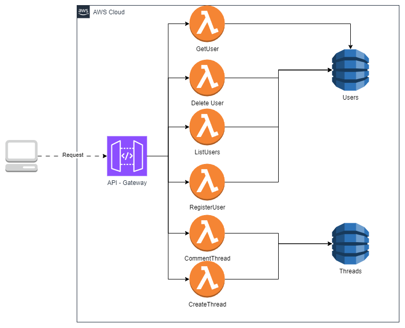
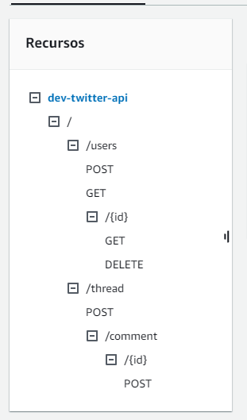
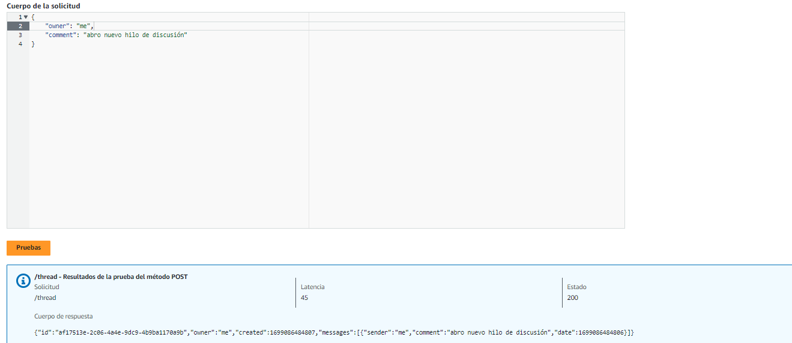
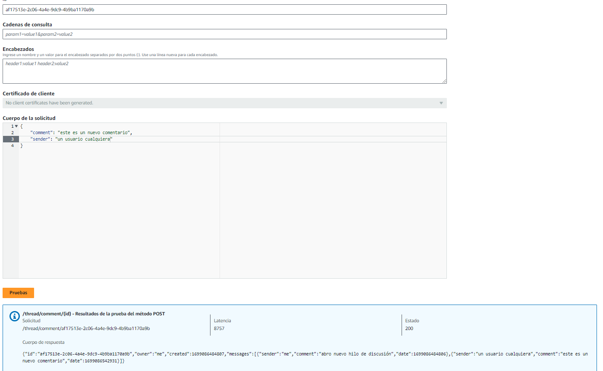
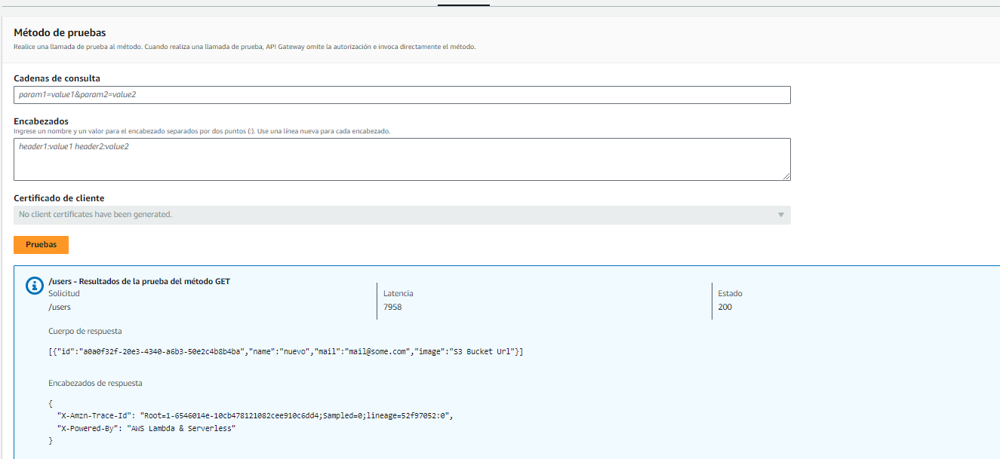
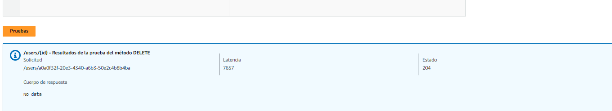

# ARCHITECTURE OF MASSIVELY DISTRIBUTED APPLICATIONS
## Resumen
Este repositorio contiene el resultado de la aplicación del mnodelo arquitecónico por microservicios. La solución pretende funcionar cómo un prototipo mínimo para la solución de intercambio de mensajes e hilos de Twitter. 

## Detalles técnicos del proyecto
- [Java 8](https://www.oracle.com/co/java/technologies/javase/javase8-archive-downloads.html)
- [Serverless Framework](https://www.serverless.com/)
- [Maven](https://maven.apache.org/)
- [AWS API Gateway](https://aws.amazon.com/api-gateway/)
- [Dynamo DB](https://aws.amazon.com/pm/dynamodb/?gclid=EAIaIQobChMIw_uw-eypggMVSJCGCh0QdgbnEAAYASAAEgKB4vD_BwE&trk=25284480-59e1-4326-ba66-8ac95215e983&sc_channel=ps&ef_id=EAIaIQobChMIw_uw-eypggMVSJCGCh0QdgbnEAAYASAAEgKB4vD_BwE:G:s&s_kwcid=AL!4422!3!648041763511!e!!g!!dynamodb!19677234651!149715849327)
- [npm](https://www.npmjs.com/)

## Features
- CRUD de usuarios
- CRUD de hilos de conversación
- Abstracción de conversación / Post de comentarios


## Vista de Arquitectura


En esta vista se exponen los componentes principales de la solución. 
- API Gateway: Orquestador de peticiones HTTP
- Lambdas : Servicios independientes y desacoplados que componen la solución
- Fuentes de Datos : Usuarios y Conversaciones (Bases de datos de Dynamo DB)

## Catálogo de servicios 💬

| Recurso | Operación | URL                  | Descripción                                                     |
|---------|-----------|----------------------|-----------------------------------------------------------------|
| Users   | GET       | /users/              | Lista los usuarios registrados de la solución                   | 
| Users   | POST      | /users/              | Registra un nuevo usuario en la solución                        | 
| Users   | GET       | /users/{id}          | Obtiene el usuario con id = {id} registrado en la solución      | 
| Users   | DELETE    | /users/{id}          | Elimina el usuario con {id} de la solución                      | 
| Thread  | POST      | /thread/             | Crea un nuevo hilo de discusión                                 | 
| Thread  | POST      | /thread/comment/{id} | Añade un comentario en la última posición del hilo de discusión | 


# Representación de los recursos

### Usuarios
```java
public class User {
    private String id; // ID de ddynamo auto-generado
    private String name; // Nombre
    private String mail; // El correo del usuario
    private String image; // La imagen de perfil (S3)
}
```

### Hilos de discusión
```java
public class Thread {

    private String id;
    private String owner;
    private Date created;
    private List<Message> messages;
}
```
## Evidencias

### Vista general de los recursos


### Crear Hilo de discusión 



### Añadir Comentario


### Registrar Usuario


### Consultar Usuarios


### Eliminar Usuario


## Instalación
 
- Debe contar con NPM (Node Package Manager) instalado y configuado en su entorno local. 
- Instalar el framework de Serverless
```bash 
npm install -g serverless
```
- Hacer el build de la solución utilizando el siguiente comando.
```bash 
mvn clean install
```
- Invocar el comando 'Serverless', configurar en caso de ser necesario las credenciales de AWS y permisos de IAM para automatizar el despliegue de componentes definido en el archivo [serverless.yml](serverless.yml)

    - Guía de configuración : [Guia](https://www.serverless.com/framework/docs/tutorial)

<details><summary>Ver detalle</summary>
<p>

#### Encontrado en Serverless.yml

```yaml 
service: twitter-api
frameworkVersion: '3'

custom:
  usersTableName: 'java-users-${self:provider.stage}'
  threadsTableName: 'java-threads-${self:provider.stage}'

provider:
  name: aws
  runtime: java8
  stage: ${opt:stage, 'dev'}
  region: ${opt:region, 'us-east-1'}
  environment:
    USERS_TABLE_NAME: ${self:custom.usersTableName}
    THREADS_TABLE_NAME: ${self:custom.threadsTableName}

  iamRoleStatements:
    - Effect: Allow
      Action:
        - dynamodb:Query
        - dynamodb:Scan
        - dynamodb:GetItem
        - dynamodb:PutItem
        - dynamodb:UpdateItem
        - dynamodb:DeleteItem
      Resource:
        - { "Fn::GetAtt": [ "UsersDynamoDBTable", "Arn" ] }
        - { "Fn::GetAtt": [ "ThreadsDynamoDBTable", "Arn" ] }


package:
  artifact: 'target/${self:service}-${self:provider.stage}.jar'

plugins:
  - serverless-auto-swagger

functions:
  listUsers:
    handler: com.serverless.services.ListUsers
    timeout: 300
    events:
      - http:
          path: /users
          method: get
  getUser:
    handler: com.serverless.services.GetUser
    timeout: 300
    events:
      - http:
          path: /users/{id}
          method: get

  registerUser:
    handler: com.serverless.services.RegisterUser
    timeout: 300
    events:
      - http:
          path: /users
          method: post

  deleteUser:
    handler: com.serverless.services.DeleteUser
    timeout: 300
    events:
      - http:
          path: /users/{id}
          method: delete

  createThread:
    handler: com.serverless.services.CreateThread
    timeout: 300
    events:
      - http:
          path: /thread/
          method: post

  postComment:
    handler: com.serverless.services.CommentThread
    timeout: 300
    events:
      - http:
          path: /thread/comment/{id}
          method: post

resources:
  Resources:
    UsersDynamoDBTable:
      Type: AWS::DynamoDB::Table
      Properties:
        TableName: ${self:custom.usersTableName}
        AttributeDefinitions:
          - AttributeName: id
            AttributeType: S
          - AttributeName: name
            AttributeType: S
        KeySchema:
          - AttributeName: id
            KeyType: HASH
          - AttributeName: name
            KeyType: RANGE
        ProvisionedThroughput:
          ReadCapacityUnits: 1
          WriteCapacityUnits: 1
    ThreadsDynamoDBTable:
      Type: AWS::DynamoDB::Table
      Properties:
        TableName: ${self:custom.threadsTableName}
        AttributeDefinitions:
          - AttributeName: id
            AttributeType: S
          - AttributeName: owner
            AttributeType: S
        KeySchema:
          - AttributeName: id
            KeyType: HASH
          - AttributeName: owner
            KeyType: RANGE
        ProvisionedThroughput:
          ReadCapacityUnits: 1
          WriteCapacityUnits: 1

```
</details></p>

- Invocar el siguiente comando
```bash
serverless deploy
```
