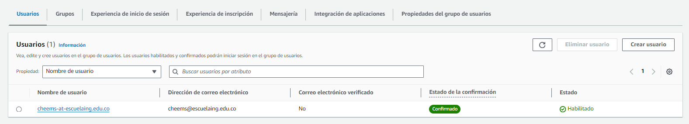

# SECURITY HOMEWORK
## Resumen
Este repositorio contiene el detalle del desarrollo del workshop AWS Serverless Application Model + Una extensión a la implementación del ejercicio "ARCHITECTURE OF MASSIVELY DISTRIBUTED APPLICATIONS" añadiendo capacidades de Seguridad, aplicando el principio de mediación completa (Autorización, Autenticación e integridad).

### Desarrollo de Workshop AWS Serverless Application Model

 - La solución de Front (GUI) para el ejemplo de renta de unicornios se realizo en el repositorio [wildrydes-site](https://github.com/sc-martinez/wildrydes-site).
 - Con configuración final en config.js
 ```javascript
    window._config = {
        cognito: {
            userPoolId: 'us-east-1_E1PKYvwVf', // e.g. us-east-2_uXboG5pAb
            userPoolClientId: '5qqjr8ki6di111cpai8ndorqgq', // e.g. 25ddkmj4v6hfsfvruhpfi7n4hv
            region: 'us-east-1' // e.g. us-east-2
        },
        api: {
            invokeUrl: 'https://qn8syadqmc.execute-api.us-east-1.amazonaws.com/prod' // e.g. https://rc7nyt4tql.execute-api.us-west-2.amazonaws.com/prod',
        }
    };
 ```
 - Se crea el sitio basado en la GUI con el repositorio github
    
    
 - Se registra un nuevo usuario en la solución
   
 - La aplicación se autentica contra cognito y genera el respectivo token JWT
   
 - La solución usa el recurso definido por lambda en el workshop para solicitar un "unicornio" en la ubicación seleccionada, se puede observar en la evidencia que la solicitud se hace al API-Gateway con el encabezado de autorización correspondiente al token generado en el paso anterior.
   


### Creación de aplicación segura Facebook/Like thread con  AWS Serverless Application Model
- Se toma cómo base la solución del repositorio [twitterAPIJava](https://github.com/sc-martinez/twitterJavaAPI) 
- Se añaden los autorizadores de cognito con la notación del framework de serverless en el archivo serverless.yml en cada uno de los recursos del API gateway
```yml
custom:
  usersTableName: 'java-users-${self:provider.stage}'
  threadsTableName: 'java-threads-${self:provider.stage}'
  authorizerARN: 'arn:aws:cognito-idp:us-east-1:771784633686:userpool/us-east-1_B9lNLt23I'
```
Notar que el parametro authorizerARN corresponde al arn del grupo de usuarios de cognito


```yml
  listUsers:
    handler: com.serverless.services.ListUsers
    timeout: 300
    events:
      - http:
          path: /users
          method: get
          cors: true
          authorizer:
              arn: ${self:custom.authorizerARN}
```
- Se añaden los atributos de dominio cruzado CORS en la respuesta de las solicitudes para cada handler
```java
public ApiGatewayResponse handleRequest(Map<String, Object> input, Context context){
        Map<String, String> headers=new HashMap<>();
        headers.put("X-Powered-By","AWS Lambda & Serverless");
        headers.put("Access-Control-Allow-Origin","*");
        headers.put("Access-Control-Allow-Credentials","true");
        .....
}
```
- Se despliega la solución con los siguientes comandos
```bash
mvn clean install
serverless deploy
```
- Una vez desplegado se toman las Urls del API Gateway para definir el punto de entrada para la interfaz gráfica GUI.
  
- El respositorio para la solución de front está en [secure-twitter-front](https://github.com/sc-martinez/secure-twitter-front), la cuál es una refactorización de la aplicación del workshop anterior, enfocada al paso de mensajes. 
- Se registran dos usuarios con la aplicación en el servicio de cognito 

- Se realizan las pruebas de envios de mensajes, se puede evidenciar el intercambio de mensajes entre los componentes de aplicación por medio de autorización por Token
  
- Demo de interacción Login y mensajes
   

- Demo de logout y actualización de número de usuarios
   
